# 🎮 GGC - Game Community Forum

一個以遊戲為主題的論壇社群平台，提供即時聊天、好友系統、討論看板等功能。

---

## 📸 頁面截圖

| 首頁 | 遊戲新聞 |
|------|--------|
| 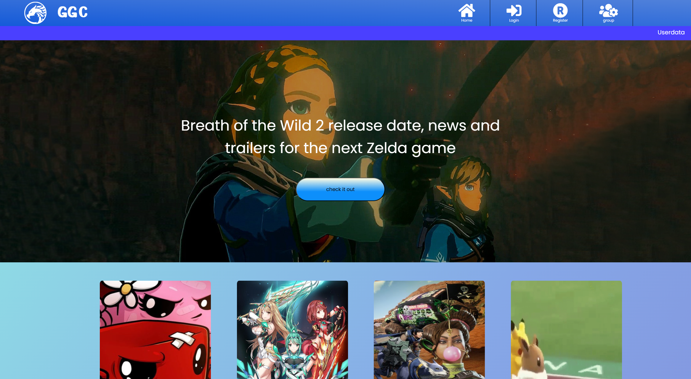 | 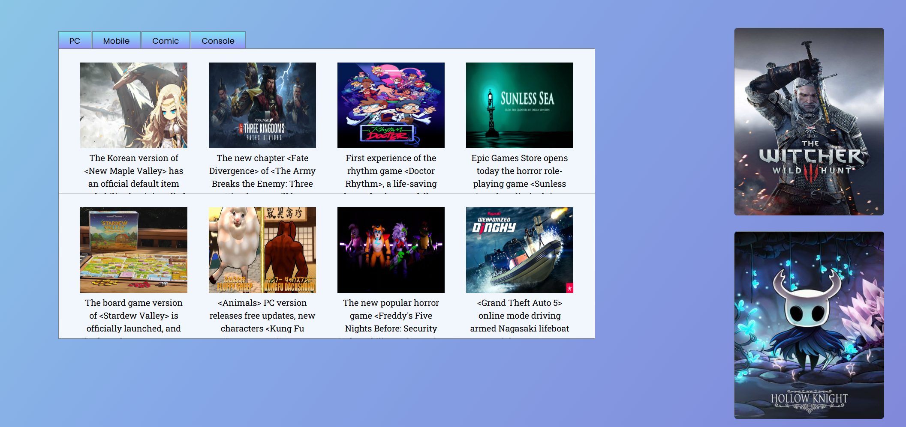 |

| 登入 | 註冊 |
|------|------|
| 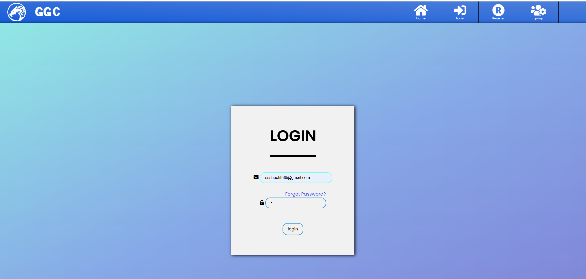 | 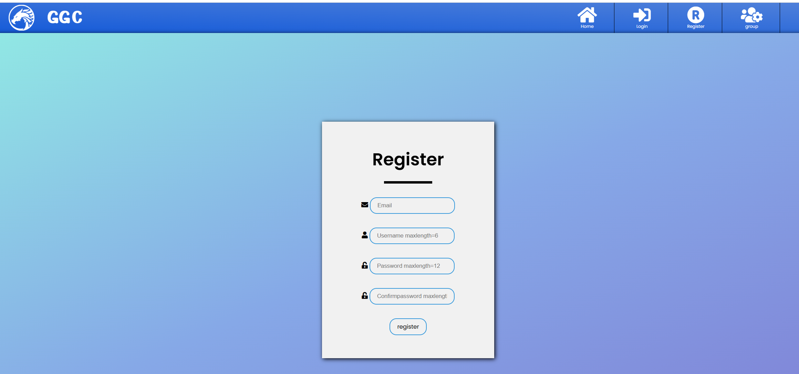 |

| 討論區 | 討論區首頁 |
|------|--------|
| 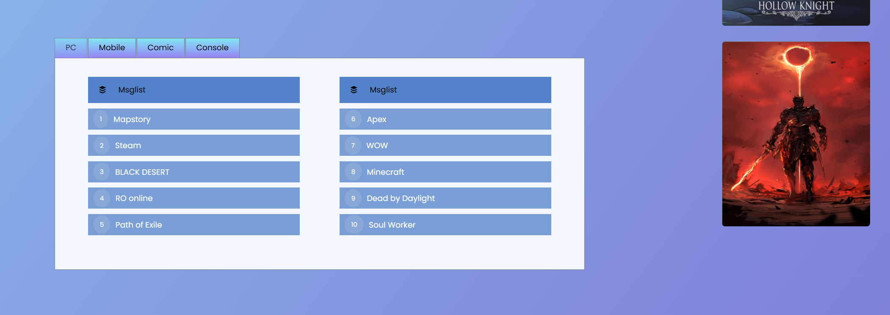 | 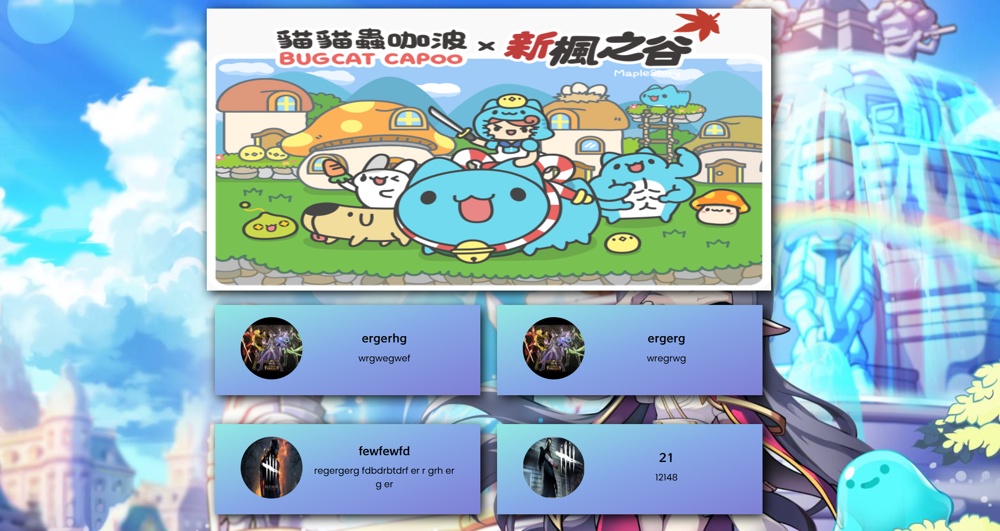 |

| 討論區內部 | 文章內部 |
|------|--------|
| 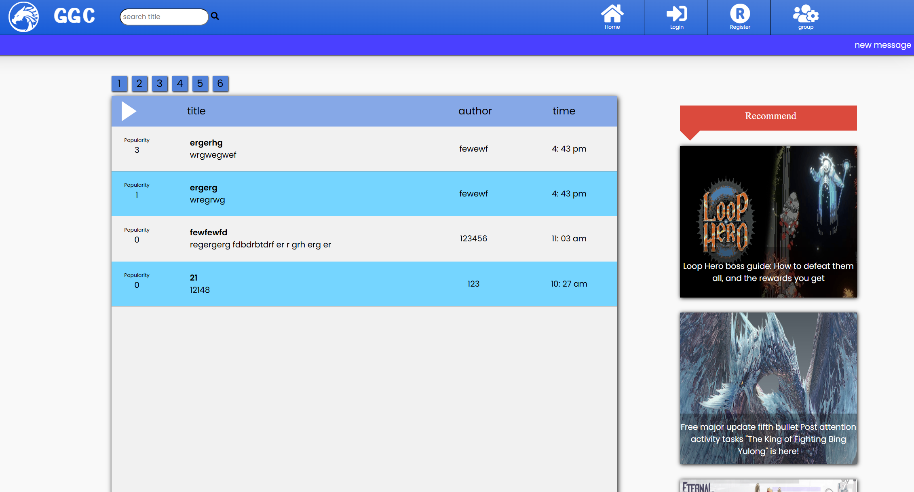 | 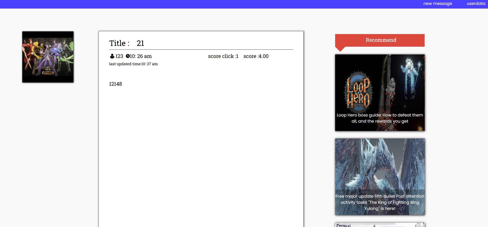 |

| 評分功能 | 評分與檢舉與分享功能 |
|------|--------|
| 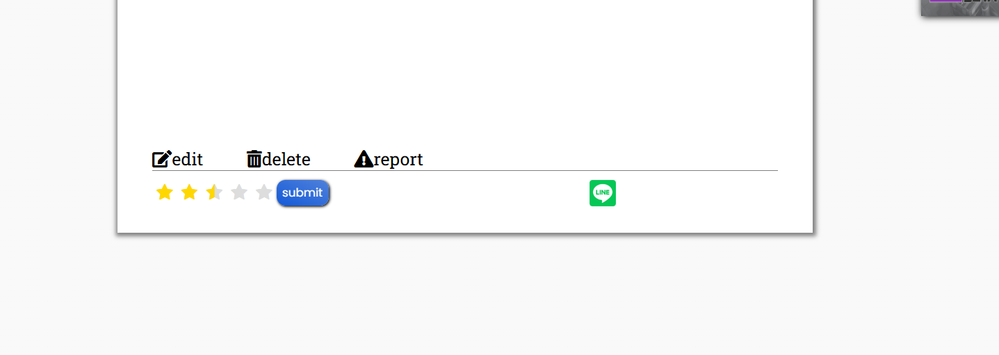 | 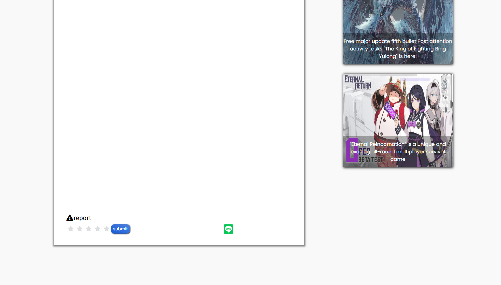 |

| 檢舉功能 | 編輯文章功能 |
|------|--------|
| 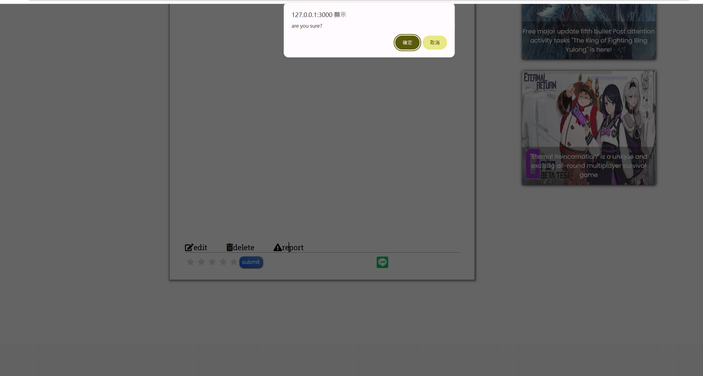 | 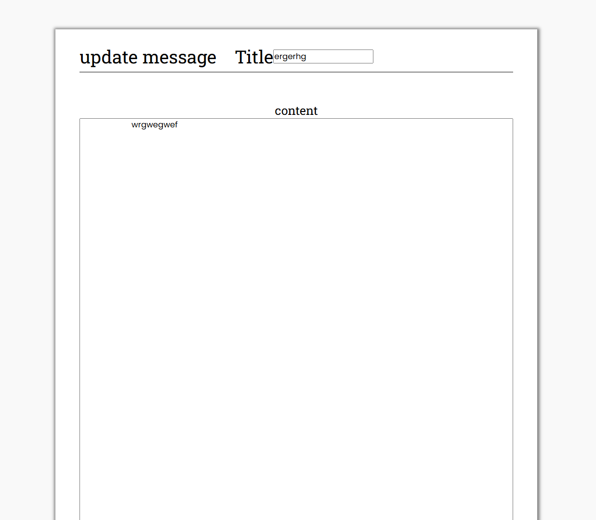 |

| 使用者檔案 | 新增朋友 |
|------|--------|
| 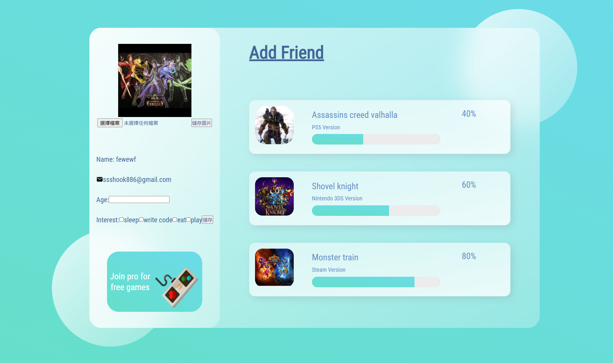 | 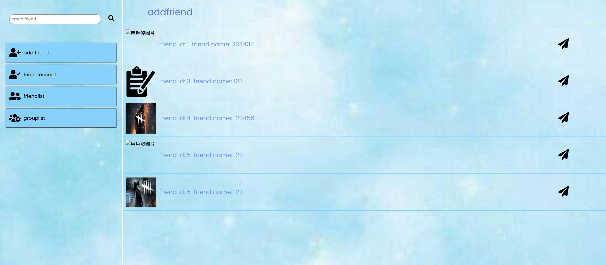 |

| 朋友確認 | 創建即時聊天室 |
|------|--------|
| 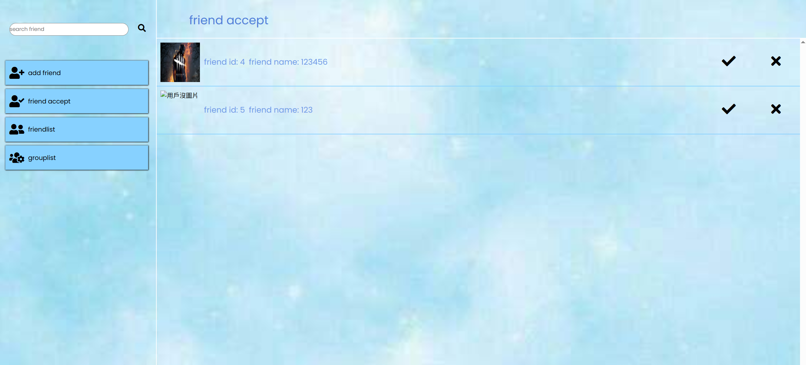 | 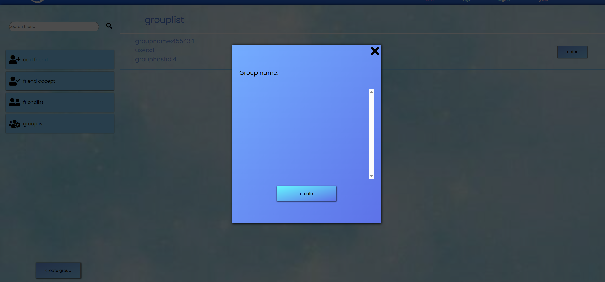 |

| 即時聊天室 | 
|-----------|
| 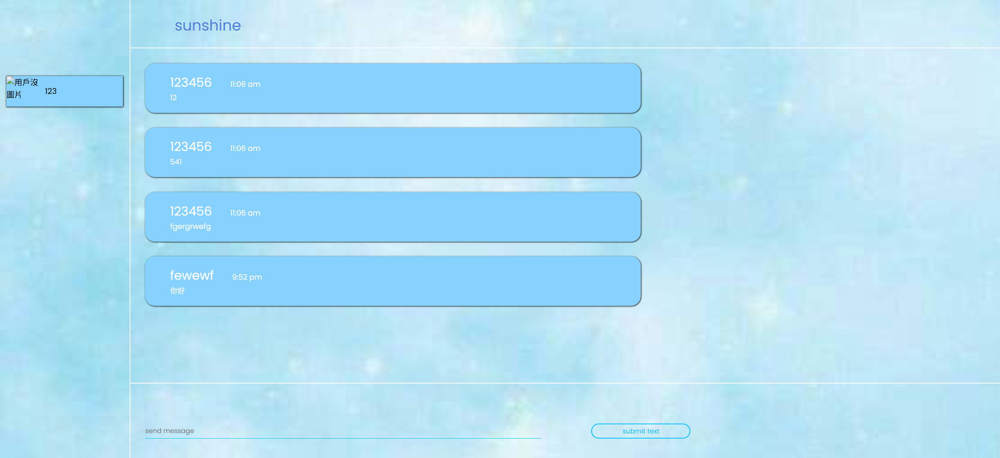 | 

---

## 📽️背景切換影片

[](https://youtu.be/FBLTp3L7tbY)

---

## ✨ 功能介紹

### 🏠 首頁
- 依 PC / Mobile / Comic / Console 分類瀏覽遊戲新聞
- 討論看板快速入口（滑鼠懸停切換分類）
- 側欄遊戲推薦圖片

### 👤 使用者系統
- 會員註冊 / 登入
- 忘記密碼功能
- 個人頁面（上傳大頭貼、設定年齡與興趣）

### 💬 討論區
- 多板塊討論（Mapstory、Steam、Black Desert 等 40 個看板）
- 背景切換動畫
- 文章發表、編輯、刪除
- 評分功能（5 星制）
- 檢舉功能
- LINE 分享功能
- 文章搜尋 / 分頁功能

### 👫 好友系統
- 搜尋好友
- 發送 / 接受 / 拒絕好友申請
- 好友列表
- 群組建立與管理

### 🔴 即時聊天室（Socket.IO）
- 基於 **Socket.IO** 的即時訊息傳送
- 群組聊天室
- 顯示發訊時間與使用者資訊

---

## 🛠️ 使用技術

| 類別 | 技術 |
|------|------|
| 後端框架 | Node.js + Express |
| 即時通訊 | Socket.IO |
| 模板引擎 | EJS |
| 資料庫 | SQLite |
| 前端 | HTML / CSS / JavaScript / jQuery |
| 檔案上傳 | express-fileupload |
| Session 管理 | express-session |
| 字型 / 圖示 | Font Awesome、Google Fonts |

---

## 📁 專案結構

```
Gameforum/
├── finalterm/          # 主要專案程式碼
│   ├── app.js          # 主程式入口
│   ├── db.js           # 資料庫設定
│   ├── routes/
│   │   ├── index.js    # 首頁路由
│   │   ├── users.js    # 使用者路由
│   │   ├── msgs.js     # 討論區路由
│   │   └── mgr.js      # 管理路由
│   ├── views/          # EJS 模板
│   ├── public/
│   │   ├── stylesheets/
│   │   ├── images/
│   │   ├── boardimages/
│   │   ├── webimages/
│   │   ├── articlepicture/
│   │   ├── defaultimages/
│   │   ├── music/
│   │   ├── personimage/
│   │   └── javascripts/
│   └── package.json
├── 論壇圖片/            # 截圖
└── README.md
```

---

## 🚀 安裝與執行

### 環境需求
- Node.js v14+
- npm

### 步驟

```bash
# 1. 複製專案
git clone https://github.com/你的帳號/Gameforum.git
cd Gameforum/finalterm

# 2. 安裝套件
npm install

# 3. 啟動伺服器
npm start
```

### 開啟瀏覽器
```
http://localhost:3000
```

---

## 👨‍💻 開發者

- 製作：期末作業專案
- 技術支援：Node.js + Socket.IO